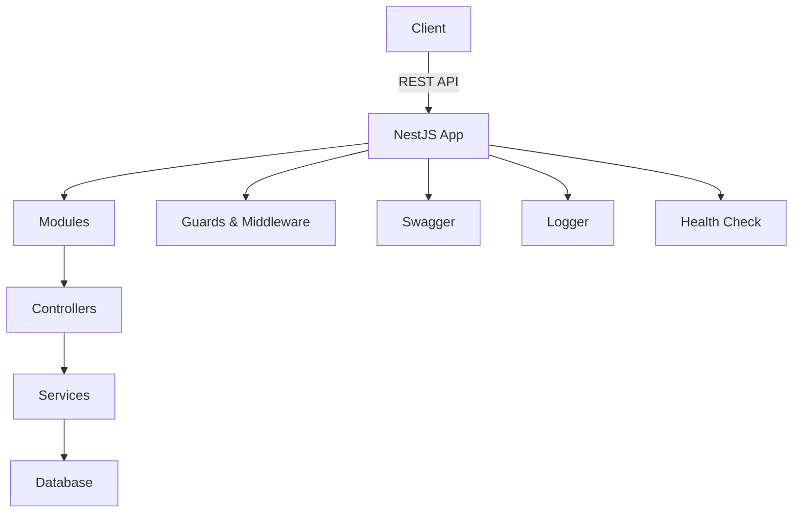

# 🚀NestJS Boilerplate Project &nbsp;   

> 🏗️ **A modern, scalable, and secure NestJS boilerplate for enterprise-grade Node.js applications.**

---

## ✨ **Key Features**

- ⚡ **Modular Architecture**: Easy to scale, maintain, and extend.
- 🔒 **Enhanced Security**: Includes JWT, CSRF protection, Helmet, and rate limiting.
- 🔑 **Social Login**: Google OAuth2 integration with Passport.js.
- 📝 **Auto-Generated API Docs**: Built-in Swagger UI.
- 🧪 **Comprehensive Testing**: Unit & E2E tests with Jest.
- 🐳 **Modern Deployment**: Docker, Docker Compose, and `.env` support.
- 🚦 **Monitoring & Health Check**: Terminus health endpoints.
- 📦 **Professional Logging**: Winston or Pino with file & console output.
- 🤖 **CI/CD Ready**: Integrated GitHub Actions, lint-staged, commitlint, and husky.
- 🛡️ **Best Practices**: Linting, Prettier, and Conventional Commits enforced.

---

## 🏛️ **Project Architecture Overview**



- **src/**
  - `modules/` – Domain modules (user, auth, etc.)
  - `shared/` – Shared modules and services
  - `config/` – App, database, logger configuration
  - `middleware/` – Custom middleware (CSRF, logger, etc.)
  - `filters/` – Exception filters
  - `guards/` – Authentication and role-based guards
  - `health/` – Health check endpoints
- **test/** – Unit & E2E test suites

---

## 🚀 **Quick Start**

### 1️⃣ Clone & Install Dependencies

```bash
git clone [https://github.com/your-org/base-nest.git](https://github.com/Nhatnguyen150100/Nestjs-boilerplate.git)
cd base-nest
pnpm install
cp .env.example .env
```

### 2️⃣ Start Development Server

```bash
pnpm start:dev
```

Access Swagger: [http://localhost:8080/documentation](http://localhost:8080/documentation)

### 3️⃣ Run with Docker

```bash
docker-compose up --build
```

---

## 🛡️ **Security & Middleware**

- **CSRF Protection**: Middleware to verify CSRF tokens on mutation requests.
- **Rate Limiting**: Throttle requests per IP address.
- **Helmet**: Set secure HTTP headers.
- **JWT Auth**: Token-based authentication and role-based access control.
- **Winston Logger**: Log to files and console for diagnostics.

---

## 🧪 **Testing**

```bash
pnpm test           # Unit tests
pnpm test:e2e       # End-to-end tests
pnpm test:cov       # Test coverage
```

---

## 📝 **Commit Rules & Code Quality**

- **Husky**: Runs checks before every commit.
- **lint-staged**: Lint & format only changed files.
- **commitlint**: Enforces Conventional Commit messages.

---

## 🛠️ **Useful Commands**

| Command             | Description               |
| ------------------- | ------------------------- |
| `pnpm start:dev`    | Run in development mode   |
| `pnpm build`        | Build for production      |
| `pnpm test`         | Run unit tests            |
| `pnpm test:e2e`     | Run E2E tests             |
| `pnpm lint`         | Lint the codebase         |
| `pnpm format`       | Format code with Prettier |
| `docker-compose up` | Start app with Docker     |

---

## 📚 **Documentation & Swagger**

- API Docs: [http://localhost:8080/documentation](http://localhost:8080/documentation)

---

## ❤️ **Contributing**

1. Fork the repository & create a new branch
2. Follow Conventional Commit standards
3. Submit a Pull Request

---

## 📣 **Resources & Support**

- [NestJS Documentation](https://docs.nestjs.com/)
- [TypeORM Docs](https://typeorm.io/)
- [Swagger](https://swagger.io/)
- [Docker Docs](https://docs.docker.com/)

---

> Made with ❤️ by nhatnguyen1500@gmail.com
